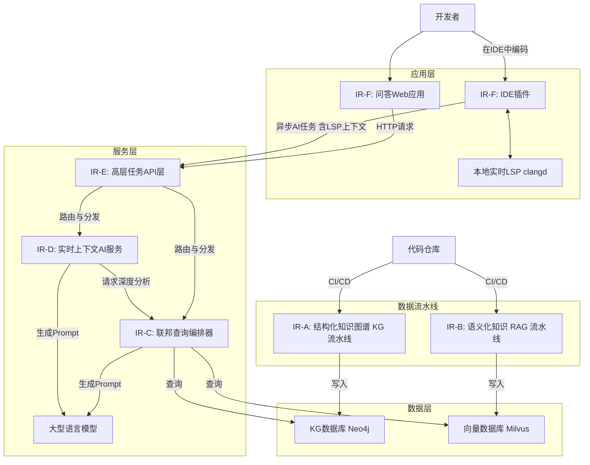

# Ascend Device Plugin

# 支持的产品形态

- 支持以下产品使用资源监测
    - Atlas 训练系列产品
    - Atlas A2 训练系列产品
    - Atlas A3 训练系列产品
    - 推理服务器（插Atlas 300I 推理卡）
    - Atlas 推理系列产品
    - Atlas 800I A2 推理服务器


# 组件介绍
设备管理插件拥有以下功能：

-   设备发现：支持从昇腾设备驱动中发现设备个数，将其发现的设备个数上报到Kubernetes系统中。支持发现拆分物理设备得到的虚拟设备并上报kubernetes系统。
-   健康检查：支持检测昇腾设备的健康状态，当设备处于不健康状态时，上报到Kubernetes系统中，Kubernetes系统会自动将不健康设备从可用列表中剔除。虚拟设备健康状态由拆分这些虚拟设备的物理设备决定。
-   设备分配：支持在Kubernetes系统中分配昇腾设备；支持NPU设备重调度功能，设备故障后会自动拉起新容器，挂载健康设备，并重建训练任务。

# 编译

1.  通过git拉取源码，并切换master分支，获得ascend-device-plugin。

    示例：源码放在/home/mind-cluster/component/ascend-device-plugin目录下

2.  执行以下命令，进入构建目录，根据设备插件应用场景，选择其中一个构建脚本执行，在“output“目录下生成二进制device-plugin、yaml文件和Dockerfile等文件。

    **cd** _/home/mind-cluster/component/_**ascend-device-plugin/build/**

     2.1 中心侧场景编译device-plugin（构建镜像，容器启动设备插件场景）
        
        chmod +x build.sh
        
        ./build.sh
        
     2.2 边侧场景编译device-plugin（二进制启动设备插件场景）
        
        chmod +x build_edge.sh
            
        ./build_edge.sh

   3.  执行以下命令，查看**output**生成的软件列表。

       **ll** _/home/mind-cluster/component/_**ascend-device-plugin/output**

       ```
       drwxr-xr-x 2 root root     4096  4月 29 09:28 ./
       drwxr-xr-x 6 root root     4096  4月 29 09:28 ../
       -r-x------ 1 root root 59349656  4月 29 09:28 device-plugin*
       -r-------- 1 root root     5555  4月 29 09:28 device-plugin-310P-1usoc-v6.0.0.yaml
       -r-------- 1 root root     5555  4月 29 09:28 device-plugin-310P-1usoc-volcano-v6.0.0.yaml
       -r-------- 1 root root     4962  4月 29 09:28 device-plugin-310P-v6.0.0.yaml
       -r-------- 1 root root     5090  4月 29 09:28 device-plugin-310P-volcano-v6.0.0.yaml
       -r-------- 1 root root     4566  4月 29 09:28 device-plugin-310-v6.0.0.yaml
       -r-------- 1 root root     4588  4月 29 09:28 device-plugin-310-volcano-v6.0.0.yaml
       -r-------- 1 root root     5024  4月 29 09:28 device-plugin-910-v6.0.0.yaml
       -r-------- 1 root root     5644  4月 29 09:28 device-plugin-volcano-v6.0.0.yaml
       -r-------- 1 root root      786  4月 29 09:28 Dockerfile
       -r-------- 1 root root     1074  4月 29 09:28 Dockerfile-310P-1usoc
       -r-------- 1 root root     4158  4月 29 09:28 faultCode.json
       -r-------- 1 root root     1256  4月 29 09:28 faultCustomization.json
       -r-------- 1 root root     2347  4月 29 09:28 run_for_310P_1usoc.sh
       -r-------- 1 root root     1017  4月 29 09:28 SwitchFaultCode.json
       ```

    >    **说明：** 
       1、“ascend-device-plugin/build“目录下的**ascendplugin-910.yaml**文件在“ascend-device-plugin/output/“下生成的对应文件为**device-plugin-910-v6.0.0.yaml**，作用是更新版本号。
       2、边侧场景编译仅生成device-plugin二进制文件


# 说明

1. 当前容器方式部署本组件，本组件的认证鉴权方式为ServiceAccount， 该认证鉴权方式为ServiceAccount的token明文显示，建议用户自行进行安全加强。


111111111113213142144214


